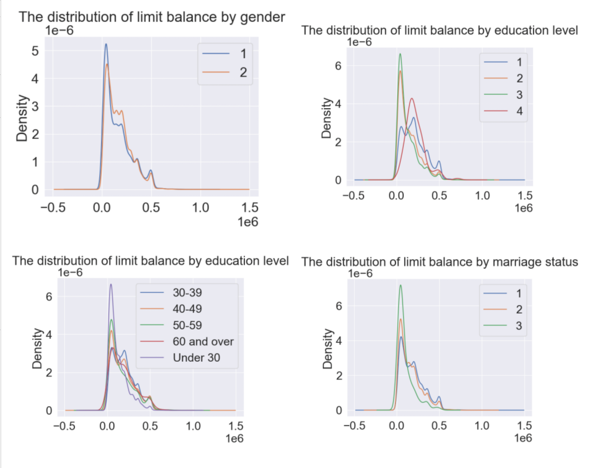
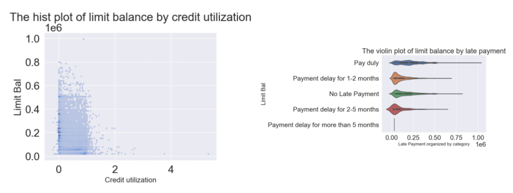
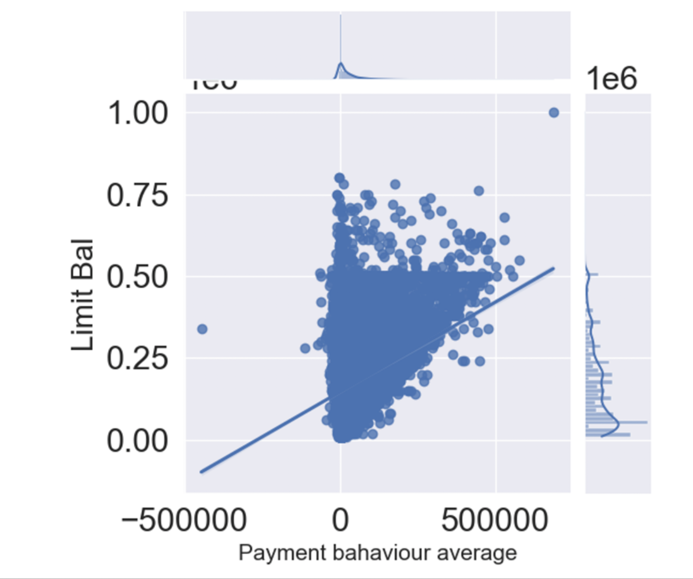

## Introduction
- While most people know the rules for using credit cards, some individuals choose to exploit them fully. Our dataset focuses on studying default payments of credit card clients in Taiwan, using six data mining techniques to predict their creditworthiness. This information can help financial institutions manage risks by limiting clients falling into high-risk categories. Our group examines default payments from both financial institutions' and clients’ perspectives, analyzing sample clients' personal profiles, including gender, educational level, marital status, age, payment behavior, and credit utilization patterns. To address our research questions, we present various visualizations and summaries through dashboards, which you can access here: [dashboards]( https://github.com/ubco-W2022T2-data301/project-group-group27/tree/main/dashboard)

## Exploratory Data Analysis
- The exploratory data analysis (EDA) focused on generating plots to visualize the connection between age, education level, gender, and marital status with the limit balance. The distribution plot clearly illustrates that education level holds the most substantial correlation with credit score compared to the other variables. Specifically, a higher education level is associated with more reliable credit scores, and individuals aged between 30-50 tend to have higher credit scores. In the remaining project, the investigation will shift to analyzing payment behavior and default payment.
-	The overall shape for plots that count the number of sample clients taking how many months to pay back their credit cards divided by gender, education level, and marital status through April to September in 2005 is mostly the same and no obvious correlation between each other is presented. 

## Research Question 1: How can banks minimize credit risk and maximize benefits when determining credit limits for clients, considering factors such as gender, age, education, marital status, payment behaviour, and credit utilization patterns?

### The motivation for selecting this dataset originated from a conversation with a bank advisor who recommended keeping my spending below half of my credit limit. For instance, if my monthly credit limit is 3,000 dollars, I should strive to keep my expenses under 1,500 dollars per month. This conversation piqued my curiosity about how banks determine credit limits. Since credit is an essential component when making significant purchases like homes, cars, and education, understanding the factors that banks consider when setting credit limits is crucial.
### Despite credit cards benefiting users, it is important to recognize that banks issue them because they can be profitable. As the fundamental concept behind credit is to loan money, inherent risks exist. Therefore, utilizing the given dataset, I aim to explore several sub-questions from a bank’s perspective:
### 1. To gain insight into credit limit determination from a bank’s perspective, I plan to investigate whether gender, age, education, and marital status impact available credit. Specifically, I aim to identify whether certain demographics should be granted higher credit limits and determine if any correlations exist between these variables and available credit. I will analyze each variable against available credit, examining factors such as whether gender influences credit availability and if elder individuals tend to have higher credit limits. Subsequently, I will combine and group these sub-comparisons to identify any relationships that may exist.

- To better understand the data, I used predefined functions to calculate the mean, minimum, and maximum values for all distinct variables. Then, I created visualizations primarily using violin plots and distribution plots. Finally, I calculated the correlation between each variable (education level, marital status, age, and gender) and the available credit. Although no strong correlation was found between these variables, education level displayed the strongest correlation. As a result of the weak correlations, it was more informative to observe relationships from the visualizations. For instance, the violin plot clearly visualized the median and density distribution. The median values for males and females are quite similar, although females have slightly higher values. Additionally, the male group exhibits a greater concentration of lower credit balances, while females show higher concentrations around the median values. In the below distribution plot, similar information is shown with information on the central tendency of the data (such as mean, median, or mode), as well as the spread or variability of the data. Based on the age distribution and violin plot, individuals under 30 were considered the bank's most risky clients, while those between 30 and 50 years old were deemed safer. Regarding marital status, the distribution and violin plot indicated that married individuals were considered safer clients compared to single individuals.

### 2. I will explore whether credit utilization patterns impact credit availability by comparing individuals with similar bills but differing bill payment patterns throughout the research period. While it is clear that payment behaviour influences credit availability, I aim to identify any correlation between the number of late payments and available credit, considering that unexpected circumstances may impact one’s ability to make payments on time.

- Based on the calculations and visualizations, it is apparent that defaulting on payments has a negative impact on the credit score. On the other hand, timely payments result in a higher amount of available credit, and credit scores decrease as payment delays increase. Nonetheless, there are many other factors to take into account, so the correlation is not particularly strong. Nevertheless, the data does indicate a clear relationship between payment history and credit score.

### 3. I plan to investigate how a client’s previous payment behaviour, such as only making minimum or partial bill payments, may affect credit availability. This will enable me to assess how banks should consider the associated risk.¶

- According to the correlation and plot analysis, there is a weak correlation between payment behavior and credit limit. The correlation value is approximately 0.22-0.25 for individual months and around 0.25 on average. Based on the plot, it appears that the unpaid amount does not have an impact on the available credit.

## Research Question 2: How do aspects in the personal profile indicated by gender, education, marital status, and age in this dataset individually determine the number of months for payment delay?

###### There are four sub-questions that can be addressed to explore the research question.
###  1. Which category in the sex group affects the length of payment delay the most?

- The categorical plot above shows each gender’s proportion in each month’s repayment status. Female clients have a larger proportion than male clients in the “-2”, “-1”, and “0” ranges which means they pay back on time. And male clients have a slightly larger proportion than female clients in delaying more than three months or above and sometimes leading the whole percentage.

### 2. How is the feature of the education level affect the length of payment delay?

- The categorical plot above shows each education level’s proportion in each month’s repayment status. Samples with graduate school education levels have slightly larger percentages in duly or early payments, and samples with university education levels dominate the portion of delayed payments.

### 3. Which marital status caused payment delay the most?

- The categorical plot above shows each marital status’s proportion in each month’s repayment status. The proportion is close to equal in the early payments and still needs more data to determine which marital status has a larger portion in delayed payments.

### 4. How will age determine the length of payment delay?

- The joint plot above demonstrates the distribution between age and the average number of months clients used to pay back. There are three hex bins that have darker colors which means many samples concentrate at that range, the three hex bins are between ages 20 to a little bit above 30 and these samples delay more than two months for their payments.

#### As result, a sample client profiling as female, graduate school education level, whether married or single, and age not between 20 to 30 can be considered a creditable client because this group tends to pay back their credit card early or duly, and a sample client profiling as male, university education level, whether married or single, and age between 20 to 30 can be considered as an uncreditable client since this group tends to delay their payment under the setting of this dataset. 
#### The full analysis notebook including the code and the data can be found [here]( https://github.com/ubco-W2022T2-data301/project-group-group27/blob/main/analysis/analysis_Remy.ipynb).

## Research Question 3: As a client, what is the best way to have the minimum negative influence on your own credit depending on your own conditions?

###### There are four sub-questions that can be addressed to explore the research question.
###  1. How does the default payment influence the given credit ?

- the bar and boxen plot shows the higher the credit they have, the less likely they will have the default payment. the line plot shows that the chance is decreasing by increasing the credit. 

###  2. How does sex,education, marriage and age influence the given credit ?
.png)
.png)
.png)
.png)
.png)
.png)

- the plots for the sex vs. given credit shows that gender doesn't influence the given credit a lot, but female generally has sliently higher given credit than male. 
- the plots for the education vs. given credit shows that graduate school has the highest given credit, highschool has the lowest credit and the other three has around the same credit. the changes are strongly dependent on the education level. 
- the plots for marriage vs. given credit shows people who married and single has roughly same amount of credit, but all higher than the others and unknown. 
- the plots for age(percentage) vs. given credit shows young people tend to want to have more credits,and can usully get it too. But the people who actually can have more credits are the people who is later middle ages. Chances are increaing by the ages from middle ages to late middle ages, but decrease from late middle age to old age. 

###  3. How does sex,education, marriage and age influence the repayment status?
.png)
.png)
.png)
.png)
.png)

- As the repayment status all shown in negative if it is late, so it means the higher the point on the graph, the later the payment happens. 
- Sex: women tend to pay more ontime/ ealier than men from all plots through several months disorvery. 
- education: people who in graduate school, unknown and others seems to perform better in repayment status, in which the graduate school is the best,but people who are in university and highschool seems doing worse than the other three, with little difference with each other. 
- marriage: people who is belongs to other group seems to has the worst repayment status through plots. But people seems to have a more stable repayment status when they are married and single, when the unknow group sometimes seems perform better but not that stable.
- age: it seems like majority of the people won't influence by the age group, but the people has more extreme performance which means more diverse of their action when they become older through plots.  

###  4. How does the amount of bill statements influence the repayment status ?
- the topay(which is caculated by the billpay with the repay status) demostrate the stress of return for the future. Through the changes and comparasion between each topay by looking at the plots, it clealy shows that the more people borrow, the longer people return, the more stress people will have. As topay is increasing through time. 

#### In conclusion through combination of all my research quesions, the best way to minimize the negative influence depends on your own condition is consider gender wise, people don't need to worry too much as they seems they can control themselves when they borrow, but male should pay more attention than female, education wise if you are in university or highschool you should focus more. marriage wise people who are not single or married should be more careful, and age wise if people are getting older they should plan from younger ages. Also, the less you borrow, the more chances you will have a better credit. Last, people should be careful about when they decide to return the money they lack, the ealier the better. 

## Conclusion 

